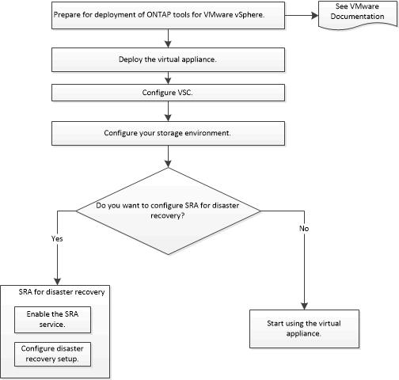

= Implementierungs-Workflow für neue Benutzer von ONTAP Tools für VMware vSphere
:allow-uri-read: 
:icons: font
:imagesdir: ../media/

[role="lead"]
Wenn Sie neu bei VMware sind und noch nie ein NetApp VSC Produkt verwendet haben, müssen Sie Ihren vCenter Server konfigurieren und einen ESXi Host einrichten, bevor Sie die ONTAP Tools implementieren und konfigurieren.

